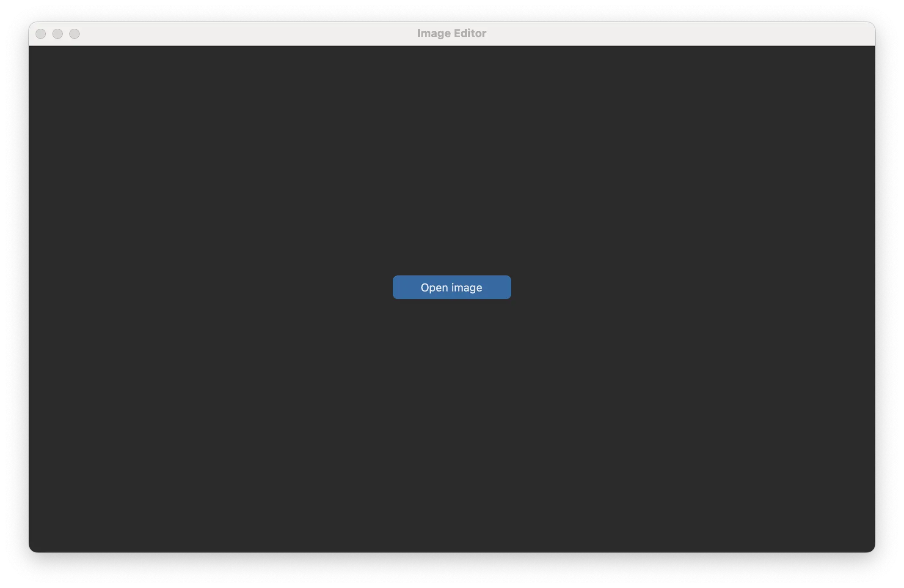
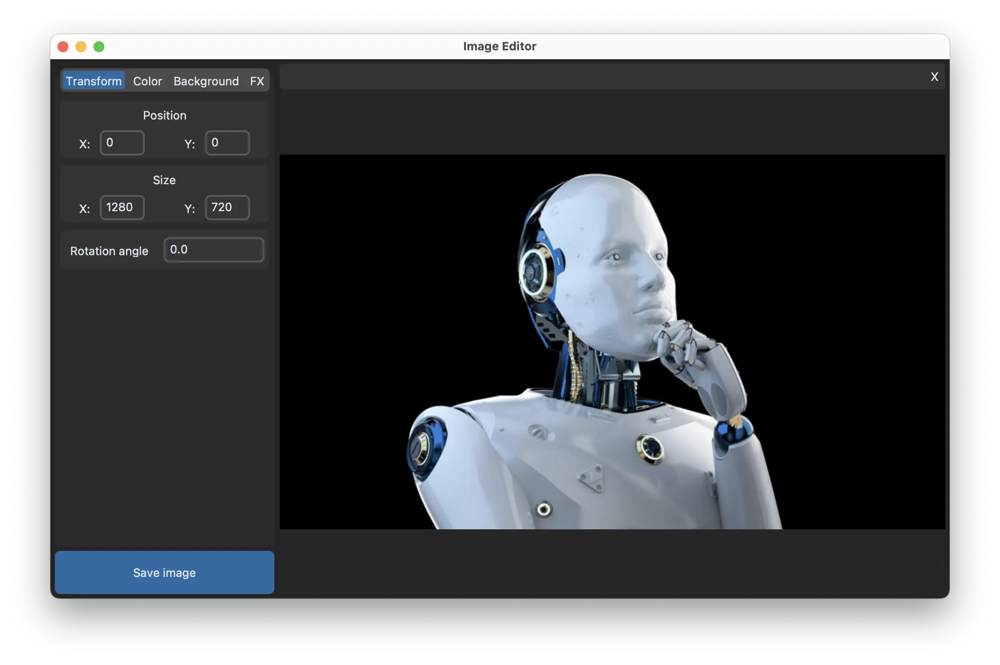
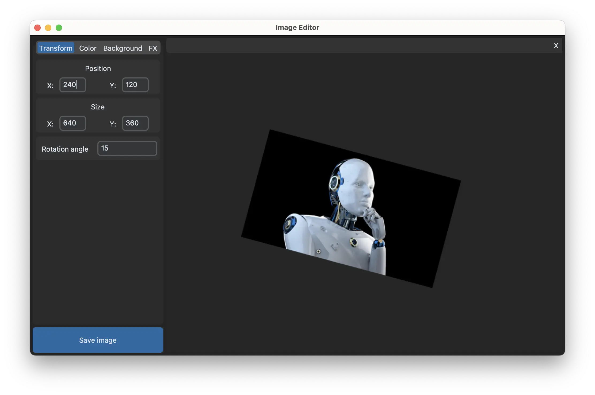
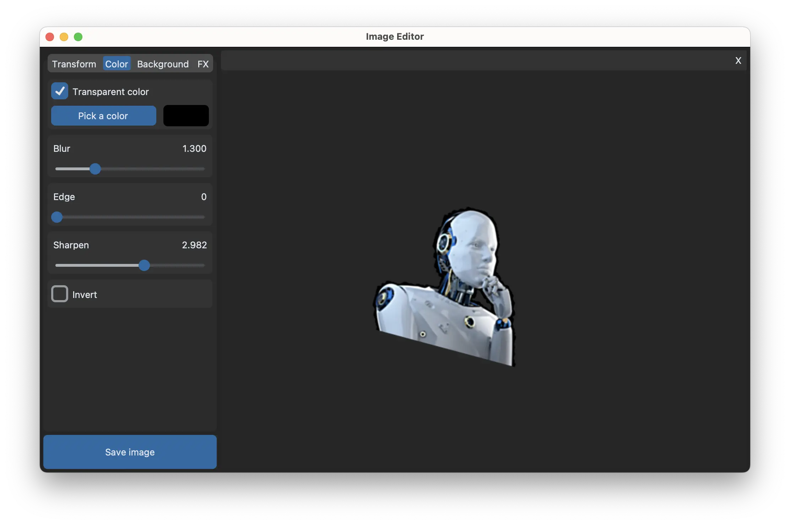
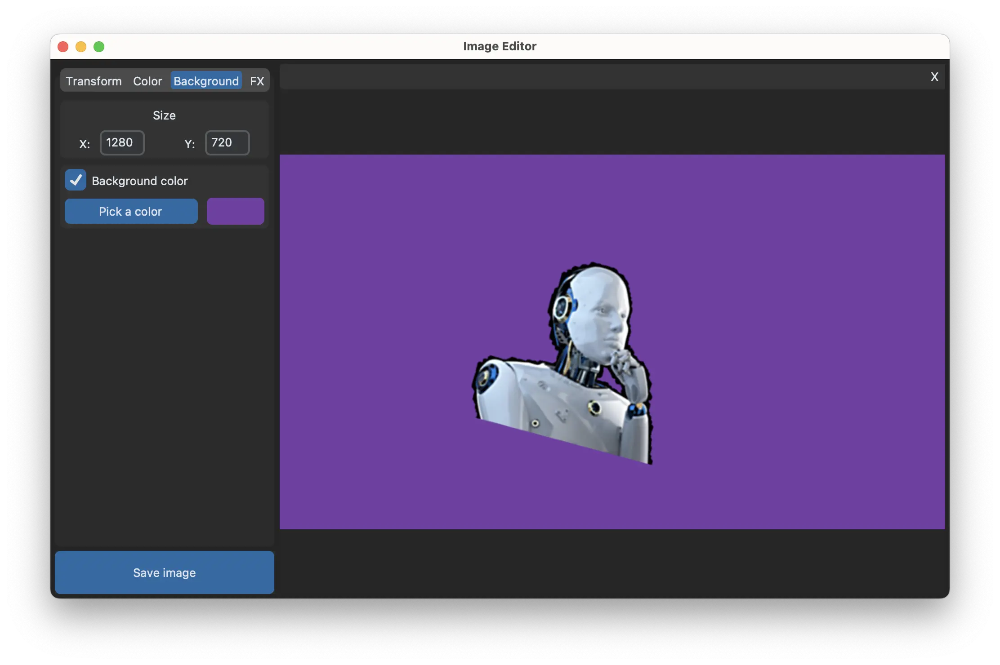
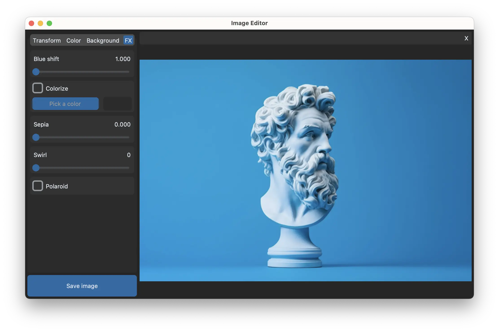
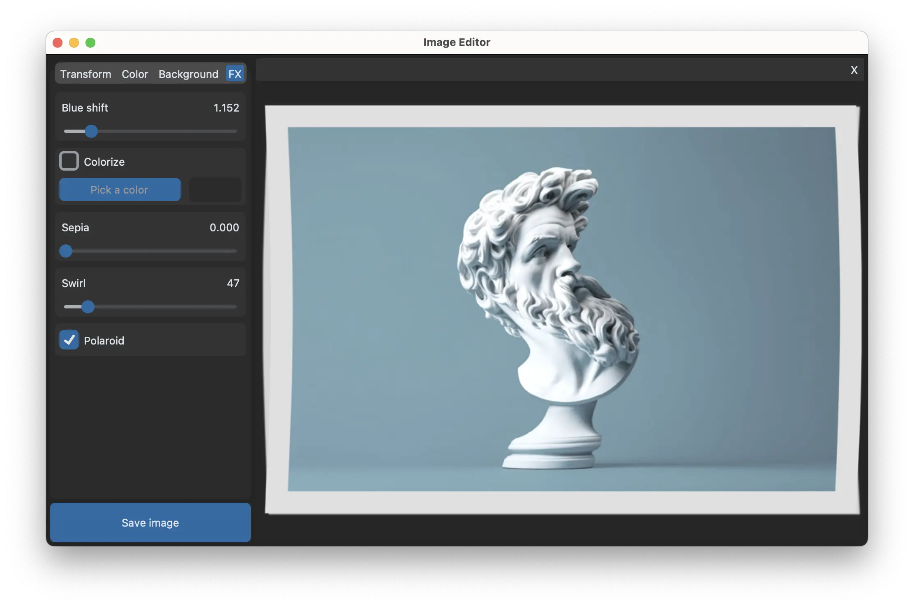
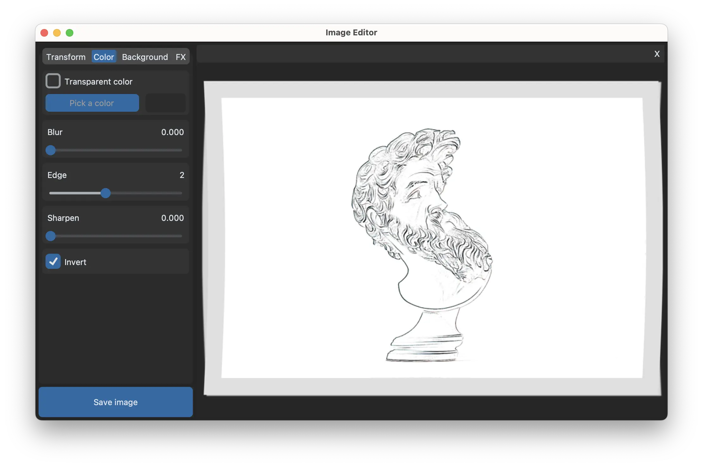

# Image Editing Application

## Overview

The Image Editing Application is a versatile tool for manipulating and enhancing images. Whether you are a professional photographer or an enthusiast, this application provides a user-friendly interface with a wide range of features to meet your image editing needs.

## Features

- **Intuitive User Interface:** A clean and user-friendly interface designed to make image editing easy and accessible.

- **Editing Tools:**
  - Move, resize, and rotate images.
  - Gaussian blur, edge detection, background color deletion
  - Background extension
  - Apply various filters and effects.

- **Export Options:**
  - Save edited images in all formats supported by ImageMagick (JPEG, PNG, GIF, WEBP, HEIC, and more).

## Showcase









## Getting Started

### Prerequisites

- Python 3.9
- Custom Tkinter
- Pillow
- Wand
- packaging
- CTkColorPicker
- ImageMagick 7
[!NOTE]
To install ImageMagick please follow [this article](https://docs.wand-py.org/en/0.6.13/guide/install.html#install-imagemagick-on-debian-ubuntu)

All specified in 'requirements.txt'

### Installation

   ```bash
   git clone https://github.com/twentyone212121/py_image_editor.git
   cd py_image_editor
   pip install -r requirements.txt
   ```
### Usage

1. Run the application
   ```bash
   python main.py
   ```
1. Open an image file or create a new project.

1. Explore the editing tools and make adjustments to your images.

1. Save or export the edited image.

